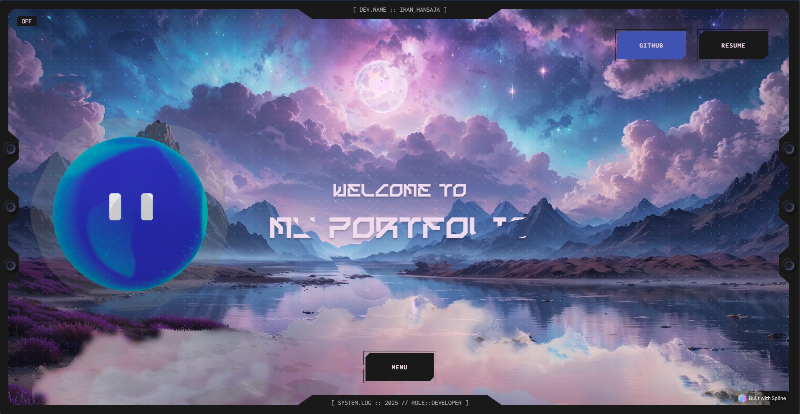
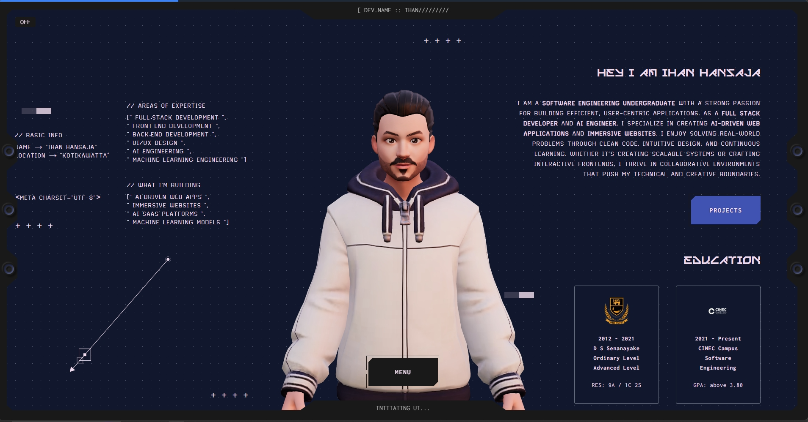

# 🌌 Immersive Portfolio

<div align="center">

[](https://ihanhansaja.dev/)
[](https://nextjs.org/)
[](https://threejs.org/)
[](https://greensock.com/gsap/)
[](https://react.dev/)

**A premium, high-performance, and immersive 3D portfolio experience.**

[Features](#-key-features) • [Tech Stack](#-tech-stack) • [Gallery](#-visual-gallery) • [Getting Started](#-getting-started)

</div>

---

## ✨ Key Features

- **🎨 Immersive 3D Experience**: Integrated high-fidelity 3D models and environments using **React Three Fiber** and **Spline**.
- **🚀 Ultra-smooth Animations**: Powered by **GSAP** and **Framer Motion** for butter-smooth transitions and micro-interactions.
- **🔊 Dynamic Audio**: Interactive soundscapes and voice-overs using **Tone.js** for a complete sensory experience.
- **📱 Fully Responsive**: A premium design that adapts perfectly to any screen size, maintainig visual excellence.
- **⚡ Performance Optimized**: Leveraging Next.js 15 and optimized asset loading for lightning-fast delivery.

## 🛠 Tech Stack

- **Framework**: [Next.js 15](https://nextjs.org/) (App Router, Turbopack)
- **3D Engine**: [Three.js](https://threejs.org/) with [React Three Fiber](https://r3f.docs.pmnd.rs/) & [Drei](https://github.com/pmndrs/drei)
- **Animations**: [GSAP](https://greensock.com/gsap/), [Framer Motion](https://www.framer.com/motion/), [Anime.js](https://animejs.com/)
- **Styling**: [Tailwind CSS](https://tailwindcss.com/), [Styled Components](https://styled-components.com/)
- **Audio/Music**: [Tone.js](https://tonejs.github.io/)
- **Design**: [Spline](https://spline.design/) (3D Design Tool)

## 🖼 Visual Gallery


### 📸 Project Snapshots
<div align="center">
  
  
  <br />
  
</div>

## 🚀 Getting Started

To run this project locally, follow these steps:

1. **Clone the repository:**

```bash
git clone https://github.com/your-username/immersive-portfolio.git
```

1. **Install dependencies:**

```bash
npm install
```

1. **Run the development server:**

```bash
npm run dev
```

1. **Build for production:**

```bash
npm run build
```

---

<p align="center">Made by Ihan Hansaja @2025</p>
